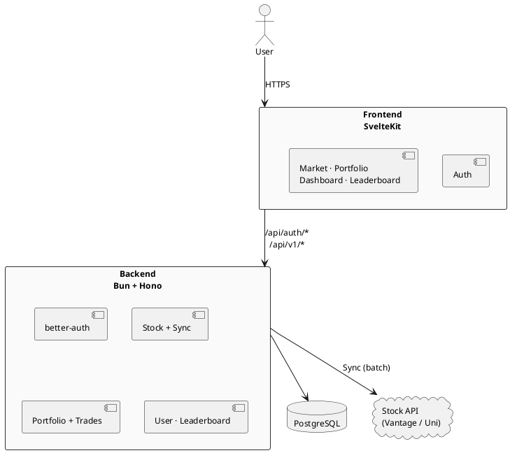

# ScaleRepublic – Architektur (Soll)

**TU Stock Exchange · PP3S 2026** — Stand: aktueller Integrations-Branch

Drei Schichten: **SvelteKit** (UI) → **Hono** (API) → **PostgreSQL** (Domäne + Kurse). Marktdaten per **Sync-Job** von externen APIs in `stock_price`; Trades und Portfolio nur über die API.

| Schicht | Inhalt |
| -------- | ------ |
| **Frontend** | Login, Kurse/Handel, eigenes Portfolio, Rangliste |
| **Backend** | Session-Auth, Kurse aus DB, Buy/Sell + Ledger, Sync |
| **DB** | User, Portfolio, Trade, Stock, Stock-Preise |
