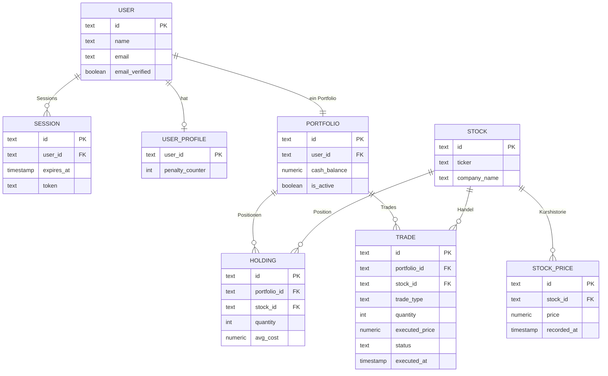
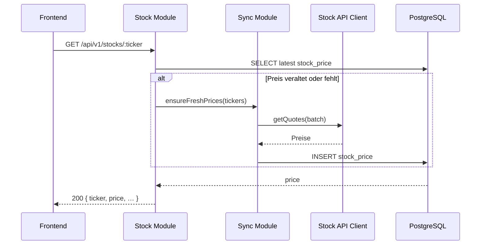
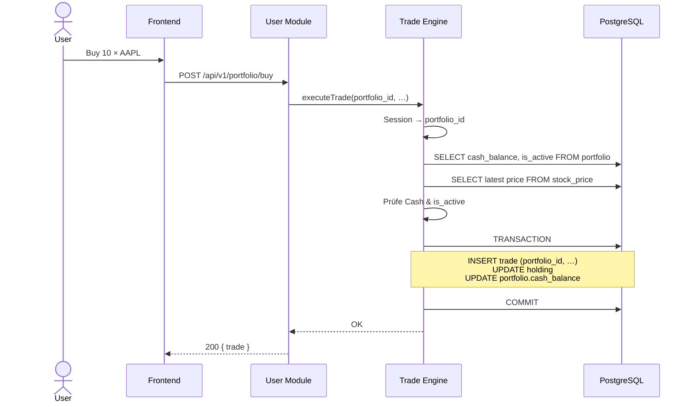

# ScaleRepublic – System Architecture

**TU Stock Exchange** | PP3S Summer Semester 2026  
Stand: 2026-05-30

---

## Übersicht

ScaleRepublic ist ein Toy-Stock-Exchange mit **Frontend** (SvelteKit), **Backend** (Bun + Hono) und **PostgreSQL** (Drizzle). Marktdaten kommen über externe APIs; ein **Sync-Modul** holt Kurse periodisch und schreibt sie in die DB. Das **Stock-Modul** liest nur aus dieser Schicht (kein direktes Polling pro Request). **better-auth** verwaltet Login, Sessions und E-Mail-Verifikation intern — `account` und `verification` sind Implementierungsdetails des Adapters, nicht Teil unseres Domänenmodells.

---

## PlantUML – Zielbild (Soll-Architektur)

Vorschau z. B. mit der [PlantUML Online Editor](https://www.plantuml.com/plantuml/uml/) oder der VS-Code-Extension „PlantUML“. Zum Abgleich mit dem Code siehe [Ist-Stand](#plantuml--ist-stand-code-stand-dev-branch) unten.

```plantuml
@startuml ScaleRepublic_Target
!include https://raw.githubusercontent.com/plantuml-stdlib/C4-PlantUML/master/C4_Container.puml

LAYOUT_WITH_LEGEND()
title ScaleRepublic – Zielbild (Soll)

Person(user, "User", "Registrierter Nutzer")

System_Boundary(fe, "Frontend – SvelteKit") {
    Container(login_page, "Login / Register", "Route", "better-auth Client")
    Container(dashboard, "Dashboard", "Route", "Portfolio, PnL")
    Container(search_page, "Market", "Route", "Kurse, Buy/Sell")
    Container(portfolio_page, "My Stocks", "Route", "Holdings")
    Container(leaderboard, "Leaderboard", "Route", "Rangliste")
}

System_Boundary(be, "Backend – Bun + Hono") {
    Container(api_gw, "API Gateway", "Hono", "Routing, Zod, CORS")
    Container(auth_mod, "Auth", "better-auth", "Session, Email+Password")
    Container(stock_mod, "Stock Module", "Routes + Service", "Kurse, Metadaten")
    Container(sync_mod, "Sync Module", "Scheduler + Job", "Preise periodisch holen")
    Container(user_mod, "User Module", "Routes + Service", "Profil, Portfolio, Leaderboard")
    Container(trade_mod, "Trade Engine", "Service", "Buy/Sell, Holdings, Defaults")
    Container(stockapi, "Stock API Clients", "Adapter", "Yahoo / Vantage / Mock")
}

System_Boundary(db, "PostgreSQL – Domäne") {
    ContainerDb(db_user, "user", "Auth", "better-auth")
    ContainerDb(db_session, "session", "Auth", "better-auth")
    ContainerDb(db_profile, "user_profile", "Domäne", "penalty_counter, …")
    ContainerDb(db_portfolio, "portfolio", "Domäne", "user_id, cash_balance, is_active")
    ContainerDb(db_holding, "holding", "Domäne", "portfolio_id, stock_id, qty, avg_cost")
    ContainerDb(db_trade, "trade", "Domäne", "portfolio_id, stock_id, type, …")
    ContainerDb(db_stock, "stock", "Markt", "Ticker, Name, …")
    ContainerDb(db_price, "stock_price", "Markt", "stock_id, price, recorded_at")
}

System_Ext(yahoo, "Market Data API", "Yahoo / Vantage")

Rel(user, login_page, "HTTPS")
Rel(user, dashboard, "HTTPS")
Rel(user, search_page, "HTTPS")
Rel(user, portfolio_page, "HTTPS")
Rel(user, leaderboard, "HTTPS")

Rel(login_page, api_gw, "/api/auth/*")
Rel(search_page, api_gw, "/api/v1/stocks, trades")
Rel(dashboard, api_gw, "/api/v1/portfolio")
Rel(leaderboard, api_gw, "/api/v1/leaderboard")

Rel(api_gw, auth_mod, "Auth")
Rel(api_gw, stock_mod, "Stocks")
Rel(api_gw, user_mod, "Users, Portfolio, Leaderboard")
Rel(api_gw, trade_mod, "Trades")

Rel(stock_mod, sync_mod, "Aktuelle Kurse (Cache + Trigger)")
Rel(sync_mod, stockapi, "Batch-Fetch")
Rel(stockapi, yahoo, "HTTP")

Rel(sync_mod, db_price, "INSERT latest prices")
Rel(sync_mod, db_stock, "UPSERT Metadaten")
Rel(stock_mod, db_price, "SELECT latest price")
Rel(stock_mod, db_stock, "SELECT")

Rel(user_mod, db_profile, "Profil, penalty_counter")
Rel(user_mod, db_portfolio, "Cash, is_active")
Rel(user_mod, db_holding, "Holdings, Leaderboard")
Rel(user_mod, db_price, "Bewertung")
Rel(trade_mod, db_trade, "Ledger")
Rel(trade_mod, db_portfolio, "Cash, is_active")
Rel(trade_mod, db_holding, "Positionen")
Rel(trade_mod, stock_mod, "Ausführungspreis")

Rel(auth_mod, db_user, "R/W")
Rel(auth_mod, db_session, "R/W")

SHOW_LEGEND()
@enduml
```

**Hinweis:** `account` und `verification` existieren ggf. in der DB für better-auth, werden hier nicht modelliert.

---

## PlantUML – Ist-Stand (Code, Stand dev-Branch)

Was im Repo **tatsächlich** liegt: eigene Route-Module, viel Mock-Logik, Sync schreibt Kurse in die DB, Domänen-Tabellen nur als Drizzle-Dateien (noch nicht in `db/index` / Migration).

```plantuml
@startuml ScaleRepublic_Implemented
!include https://raw.githubusercontent.com/plantuml-stdlib/C4-PlantUML/master/C4_Container.puml

LAYOUT_WITH_LEGEND()
title ScaleRepublic – Ist-Stand (implementiert)

Person(user, "User", "Browser")

System_Boundary(fe, "Frontend – SvelteKit") {
    Container(fe_auth, "login, signup", "Routes", "better-auth Client")
    Container(fe_dash, "dashboard", "Route", "Mock Performance")
    Container(fe_market, "search", "Route", "mockStocks Store")
    Container(fe_port, "portfolio", "Route", "portfolioStore")
    Container(fe_lb, "leaderboard", "Route", "apiFetch Leaderboard")
}

System_Boundary(be, "Backend – Bun + Hono") {
    Container(hono, "Hono App", "index.ts", "ctx Middleware, /health")
    Container(auth_mod, "better-auth", "lib/auth.ts", "POST/GET /api/auth/*")
    Container(stock_mod, "Stock Module", "modules/stock", "Mock Liste + calculate")
    Container(sync_mod, "Sync Module", "modules/sync", "Scheduler, stock_price")
    Container(user_mod, "User Module", "modules/user", "Profil, Net Worth MOCK")
    Container(lb_mod, "Leaderboard Module", "modules/leaderboard", "GET leaderboard MOCK")
    Container(port_mod, "Portfolio Module", "modules/portfolio", "GET :userId, buy/sell MOCK")
    Container(stockapi, "stockapi", "modules/stockapi", "AlphaVantage oder Uni")
}

System_Boundary(db, "PostgreSQL") {
    ContainerDb(db_auth, "user, session", "migriert", "account, verification")
    ContainerDb(db_profile, "user_profile", "Schema", "in db/index, nicht in Migration")
    ContainerDb(db_sync, "sync_job", "Runtime", "Sync Lock/Zeitstempel")
    ContainerDb(db_market, "stock, stock_price", "Runtime", "Sync schreibt, Stock liest")
    ContainerDb(db_domain, "portfolio, holding, trade", "nur Code", "Drizzle-Schema, nicht migriert")
}

System_Ext(ext_api, "Alpha Vantage / Uni API", "STOCK_API_PROVIDER")

Rel(user, fe_auth, "HTTPS")
Rel(user, fe_dash, "HTTPS")
Rel(user, fe_market, "HTTPS")
Rel(user, fe_port, "HTTPS")
Rel(user, fe_lb, "HTTPS")

Rel(fe_auth, hono, "/api/auth/*")
Rel(fe_market, hono, "kein Stock-API Call")
Rel(fe_port, hono, "GET /api/v1/portfolio/me FEHLT")
Rel(fe_lb, hono, "GET /api/v1/leaderboard")

Rel(hono, auth_mod, "handler")
Rel(hono, stock_mod, "registerStockRoutes")
Rel(hono, user_mod, "registerUserRoutes")
Rel(hono, lb_mod, "registerLeaderboardRoutes")
Rel(hono, port_mod, "registerPortfolioRoutes")

Rel(sync_mod, stockapi, "getQuote, getStockMeta")
Rel(sync_mod, stock_mod, "createStock, insertPrice")
Rel(stockapi, ext_api, "HTTP")
Rel(sync_mod, db_sync, "R/W")
Rel(sync_mod, db_market, "INSERT")
Rel(stock_mod, db_market, "SELECT/INSERT teils")

Rel(auth_mod, db_auth, "Drizzle Adapter")
Rel(user_mod, db_profile, "geplant, aktuell Mock")
Rel(lb_mod, db_domain, "geplant, aktuell Mock")
Rel(port_mod, db_domain, "geplant, aktuell Mock")

SHOW_LEGEND()
@enduml
```

### Abgleich Soll (oben) vs. Ist (Code)

| Bereich | Soll (`architecture.md`) | Ist (Repo) |
| -------- | ------------------------- | ----------- |
| **User + Portfolio** | Ein User-Modul: Profil, Portfolio, Leaderboard | **3 Module:** `user` (Mock), `leaderboard` (Mock), `portfolio` (Mock, eigene `PortfolioService` ohne `ctx`) |
| **Trade Engine** | Eigenes Modul, atomic Trades, `portfolio_id` | **Kein Trade-Engine-Modul** — `buy`/`sell` in `portfolio.services.ts`, nur Mock-Rückgabe, kein DB-Ledger |
| **Stock ↔ Sync** | Stock liest DB, Sync holt Kurse | **Sync → DB** (`stock`, `stock_price`, `sync_job`); **GET /stocks** liefert feste **Mock-Liste**, nutzt Sync-Preise nicht |
| **Leaderboard** | User-Modul, `holdingsValue`, `returnPercent`, … | **Eigenes Modul**, Mock mit `portfolioValue`, `isDefaulted` — passt nicht zu Frontend-Types |
| **Portfolio-API** | User-gebunden | Backend: `GET /api/v1/portfolio/:userId` — Frontend branch: `GET /api/v1/portfolio/me` (**404**) |
| **DB `portfolio`** | `user_id`, `cash_balance`, `is_active` | Schema-Datei mit `status` ENUM `ACTIVE/DEFAULTED`, `starting_capital` — **nicht** in Migration / `db/index` vollständig |
| **DB `trade`** | `portfolio_id` FK | Schema in `db/schema/trade/` — **nicht** migriert, **nicht** verwendet |
| **Auth-Tabellen** | Nur `user`, `session` im Domänendiagramm | **Implementiert:** `user`, `session`, `account`, `verification` (better-auth + Migration) |
| **Frontend Market** | API-Kurse | **`mockStocks`** in `market.svelte.ts` |
| **Frontend Dashboard** | Portfolio-API | **`buildPerformanceHistory`** aus Mock |

### Implementierte API-Endpunkte (Backend)

| Methode | Pfad | Modul | Datenquelle |
| -------- | ----- | ------ | ------------- |
| GET/POST | `/api/auth/*` | better-auth | PostgreSQL |
| GET | `/api/v1/stocks` | stock | Mock-Array |
| POST | `/api/v1/stocks/calculate` | stock | Berechnung |
| GET | `/api/v1/users/:id` | user | Mock |
| GET | `/api/v1/users/:id/net-worth` | user | Mock |
| GET | `/api/v1/leaderboard` | leaderboard | Mock |
| GET | `/api/v1/portfolio/:userId` | portfolio | Mock |
| POST | `/api/v1/portfolio/buy` | portfolio | Mock |
| POST | `/api/v1/portfolio/sell` | portfolio | Mock |
| GET | `/api/v1/portfolio/:userId/value` | portfolio | Mock |

### Drizzle / DB (kurz)

| Artefakt | Status |
| --------- | ------ |
| Migration `0000_…sql` | `user`, `session`, `account`, `verification`, `example_items` |
| `db/index.ts` Schema-Map | `userProfile` + better-auth |
| Schema-Dateien vorhanden | `portfolio`, `holding`, `trade`, `auto_trade`, `stock`, `stock_price`, `sync_job` |
| Sync-Service | Läuft beim Start (`startScheduler`), schreibt über `StockService` in `stock` / `stock_price` |

---

## Mermaid – Datenbank-Schema (ER-Diagramm)



### Domänen-Regeln

| Entität | Zweck |
| -------- | ------ |
| **portfolio** | Pro User genau eine Zeile: verfügbares Cash (`cash_balance`) und `is_active`. `false` = inaktiv (z. B. nach Default). |
| **user_profile.penalty_counter** | Wird erhöht, sobald `portfolio.is_active` von `true` → `false` wechselt (Anzahl Inaktivierungen). |
| **holding** | Aktuelle Positionen pro `(portfolio_id, stock_id)`; wird bei Trade-Ausführung aktualisiert. |
| **trade** | Append-only Ledger; immer über `portfolio_id`, nie über `user_id`. |
| **stock_price** | Wird vom Sync-Job befüllt; Stock-, User- und Trade-Engine lesen den letzten Preis daraus. |

---

## Mermaid – Sequenz: Kursabruf (Stock → Sync)



---

## Mermaid – Sequenz: Trade-Ausführung



---

## Backend-Module (kurz)

| Modul | Aufgabe |
| ----- | -------- |
| **API Gateway** | Hono, Zod, CORS |
| **Auth** | better-auth → `user`, `session` |
| **Sync** | Scheduler, Lock, Batch-Polling → `stock`, `stock_price` |
| **Stock** | Kurse/Meta aus DB; delegiert Refresh an Sync |
| **User** | Profil, Portfolio-Abfragen, Net Worth, Leaderboard |
| **Trade Engine** | Atomic Buy/Sell, Holdings-Updates, Default bei Insolvenz (`portfolio_id`) |

**Laufzeit:** Bun · **ORM:** Drizzle · **Validierung:** Zod

---

## Default & Penalties

1. Job oder Trade-Logik prüft Net Worth (Cash + Holdings × `stock_price`).
2. Unterschreitung Schwellwert → `portfolio.is_active = false`.
3. `user_profile.penalty_counter` += 1 (nur bei Übergang aktiv → inaktiv).
4. Keine neuen Trades solange `is_active = false`; Re-Entry (neues Cash / Reset) setzt `is_active = true` (Produktentscheidung).

---

## Frontend-Routen

| Route | Inhalt |
| ----- | ------ |
| `/` | Login / Register |
| `/dashboard` | Portfolio-Übersicht |
| `/market` | Kurse, Buy/Sell |
| `/portfolio` | Holdings |
| `/leaderboard` | Rangliste |
| `/settings` | Theme, Benachrichtigungen |

---

## Tech Stack

```
Frontend:  SvelteKit · Svelte 5 · Tailwind · TypeScript
Backend:   Bun · Hono · better-auth · Drizzle · Zod
DB:        PostgreSQL
Marktdaten: Sync-Job → stock_price (Yahoo / Vantage / Mock)
Deploy:    GCP (geplant)
```

---

## Branch-Status (Kurz)

> Basis: `dev`. Vollständiger Abgleich: [Soll vs. Ist](#abgleich-soll-oben-vs-ist-code).

| Bereich | Status in dev |
| ------- | ------------- |
| Hono App, better-auth | ✅ produktiv |
| Sync → `stock` / `stock_price` | ✅ Code; Tabellen ggf. `db:push` nötig |
| Stock GET `/api/v1/stocks` | ⚠️ Mock-Liste, nicht DB |
| User / Leaderboard / Portfolio Module | ⚠️ Routes da, Mock-Daten |
| Trade Engine (eigenes Modul) | ❌ nicht vorhanden |
| Drizzle Domäne (portfolio, trade, …) | ⚠️ nur Schema-Dateien |
| Frontend → echte APIs | ⚠️ Leaderboard ja; Portfolio `/me` fehlt; Market Mock |
