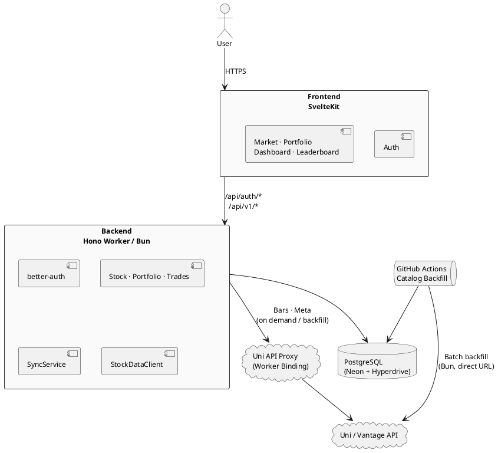

# ScaleRepublic – Architektur

**TU Stock Exchange · PP3S 2026**

Drei Schichten: **SvelteKit** (UI) → **Hono auf Cloudflare Workers / Bun** (API) → **PostgreSQL** (Domäne + Kurse). Das Frontend liest **nie** direkt von externen Stock-APIs; alle Kurse und Charts kommen aus der DB.


```plantuml
@startuml ScaleRepublic
skinparam shadowing false
skinparam defaultFontSize 12
skinparam rectangle {
  BackgroundColor #fafafa
  BorderColor #333
}

actor User

rectangle "Frontend\nSvelteKit" as FE {
  [Auth]
  [Market · Portfolio\nDashboard · Leaderboard]
}

rectangle "Backend\nHono Worker / Bun" as BE {
  [better-auth]
  [Stock · Portfolio · Trades]
  [SyncService]
  [StockDataClient]
}

database "PostgreSQL\n(Neon + Hyperdrive)" as DB
cloud "Uni API Proxy\n(Worker Binding)" as PROXY
cloud "Uni / Vantage API" as EXT
queue "GitHub Actions\nCatalog Backfill" as GHA

User --> FE : HTTPS
FE --> BE : /api/auth/*\n/api/v1/*
BE --> DB
BE --> PROXY : Bars · Meta\n(on demand / backfill)
PROXY --> EXT
GHA --> EXT : Batch backfill\n(Bun, direct URL)
GHA --> DB

@enduml
```

## Schichten

| Schicht | Inhalt |
| -------- | ------ |
| **Frontend** | Login, Markt-Browse, Stock-Detail, Portfolio, Performance-Charts, Leaderboard |
| **Backend** | Session-Auth, Kurse aus DB, Buy/Sell + Ledger, geplanter Price-Sync |
| **DB** | User, Portfolio, Trade, Stock, `stock_price`, `stock_daily_bar`, Sync-Lock |

## Zwei getrennte Datenflüsse

### 1. Price Sync (minütlich auf Staging, stündlich auf Production)

Live-Kurse für Charts und Browse werden **nicht** bei jedem Request von der Uni-API geholt. Stattdessen schreibt der Cron-Job regelmäßig neue Zeilen in `stock_price`.

```
Cron (Worker) → SyncService.runSync()
  → StockService.insertSyntheticQuotesForAllEligible()   // 2 Bulk-SELECTs + Batch-INSERT
  → StockService.refreshStockMetricsBatch()             // dayChange / periodChange auf stock
```

**Synthetische Quotes** werden direkt in `StockService` aus der DB berechnet:

- Ticker mit Daily Bar → Zufallspreis zwischen letztem Low/High
- Fallback ohne Bar → Jitter um den letzten gespeicherten Preis
- Quelle in `stock_price.source`: `synthetic`

**Geplant:** Live-Quotes über `StockDataClient.getQuote()` (gebatcht), sobald Uni/Vantage im Sync angebunden sind.

### 2. Catalog Backfill (Namen + 30 Tage Daily Bars)

Für den vollen Katalog (~12k Ticker) reicht der Worker-Cron nicht (Subrequest-Limits, Uni Rate-Limit). Backfill läuft über **GitHub Actions** (`catalog-backfill-staging.yml`, alle 15 Min) oder lokal via `bun run backfill:catalog`.

```
Uni API → stock_daily_bar + company_name
```

Erst mit ausreichend Daily Bars erscheint ein Ticker im Browse (`catalogListedFilter`: ≥2 Bars im 30-Tage-Fenster). Detail-Views können on-demand nachladen (`DETAIL_ON_DEMAND_PREFETCH_MAX_FETCHES`).

## Market-Data-Client (`StockDataClient`)

Externer API-Client für **Metadaten und History** — nicht für den aktuellen synthetischen Price-Sync:

| Methode | Zweck |
|---------|--------|
| `getStockMeta` | Firmenname (Backfill) |
| `getDailyBar` | OHLC pro Tag (Backfill, Charts) |
| `getQuote` | Live-Quote pro Symbol (später im Sync, gebatcht) |

Konfiguration: `STOCK_API_PROVIDER=uni` auf Staging/Production. Worker erreicht die Uni-API über **Service Binding** → `scalerepublic-uni-proxy` (nip.io für IP-Origins).

## Runtime

| Umgebung | Price-Sync | Catalog-Backfill |
|----------|------------|------------------|
| **Staging Worker** | Cron `* * * * *`, `SYNC_INTERVAL_MS=60000` | GHA + on-demand Detail; `CATALOG_BACKFILL_ON_CRON=false` |
| **Production Worker** | Cron `0 * * * *` | Worker (stündlich, Budget 40 API-Calls) + GHA |
| **Bun lokal** | `startScheduler()` Poll-Loop | `bun run backfill:catalog` |

## Wichtige Tabellen

| Tabelle | Inhalt |
|---------|--------|
| `stock` | Ticker, Name, gecachte `day_change_percent` / `period_change_percent` |
| `stock_daily_bar` | OHLC pro Handelstag (`uni_api` / Backfill) |
| `stock_price` | Point-in-time Quotes (`synthetic`; später auch Live-Provider) |
| `sync_job` | Advisory Lock + `last_success_at` für Price-Sync |

## Frontend

- Markt: paginiertes Browse, Sektoren, Trending — nur **gelistete** Ticker (Backfill-Filter)
- Suche: voller Katalog inkl. noch nicht backgefüllter Symbole
- Stock-Detail / Portfolio-Charts: `priceHistory` aus DB; 1-Tages-Chart = Intraday-Snapshots aus `stock_price` (Session 07:00–20:00 Europe/Berlin)
- Polling: Live-Quotes im Frontend refreshen nur API-Responses, erzeugen keine neuen Preise

## Env-Überblick (Backend)

| Variable | Rolle |
|----------|--------|
| `STOCK_API_PROVIDER` | `uni` — Bars/Meta/Backfill |
| `SYNC_INTERVAL_MS` | Mindestabstand zwischen Price-Sync-Läufen |
| `CATALOG_BACKFILL_ON_CRON` | `false` auf Staging — kein Backfill im Worker-Cron |
| `CATALOG_BACKFILL_MAX_API_CALLS` | API-Budget pro Backfill-Pass (Worker ≤40) |

Relevante Pfade: `packages/backend/src/modules/sync/sync.service.ts`, `packages/backend/src/modules/stock/stock.service.ts`, `packages/backend/src/modules/stockapi/`, `packages/uni-api-proxy/`.
