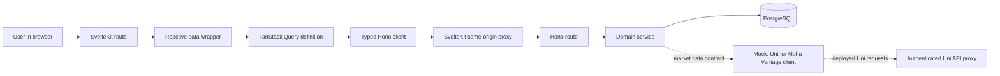
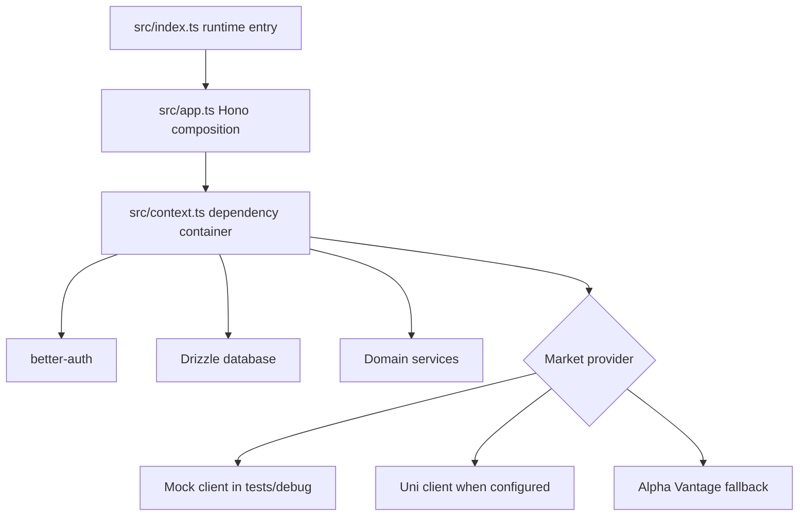
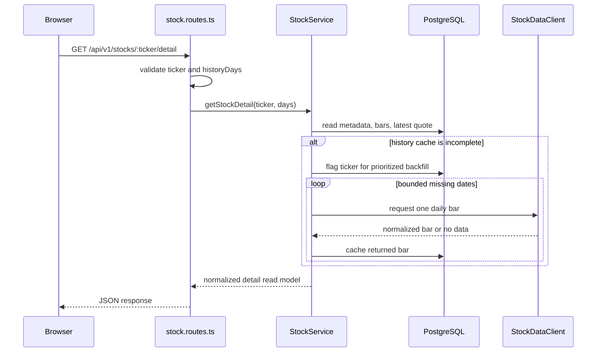
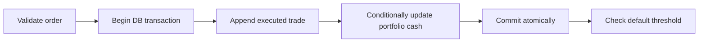

# ScaleRepublic codebase guide

This guide explains how the repository is organized, where each responsibility lives, and how a request moves through the system. It is intended as the starting point for instructors and new contributors reading the code.

Every maintained TypeScript, Svelte, JavaScript, CSS, HTML, test, script, and deployment entry point also begins with a short `Purpose` comment. Generated lockfiles, Drizzle snapshots, SQL migrations, images, and PDFs are intentionally left unchanged; their roles are described here instead.

## The system in one picture



The dependency direction is deliberate:

1. Svelte pages and components render state and collect user intent.
2. Frontend data wrappers expose reactive queries and mutations.
3. Query definitions own HTTP calls, cache keys, polling, and invalidation.
4. Hono routes apply authentication where required and validate untrusted requests.
5. Services implement business rules and database transactions.
6. Drizzle schemas define persistence; external market clients sit behind one interface.

UI code never reads PostgreSQL or an external stock API directly. Routes do not contain portfolio calculations or SQL-heavy business logic. This separation makes each layer testable and keeps backend behavior authoritative.

## Repository map

```text
scalerepublic/
├── README.md                    setup and everyday commands
├── justfile                     repository command entry point
├── docs/
│   ├── codebase-guide.md        this architectural walkthrough
│   ├── architecture.md          deployment and market-sync detail
│   └── assets/                  documentation screenshots
├── diaries/                     required PP3S project diaries
├── packages/
│   ├── backend/                 Bun/Hono API, domain rules, Drizzle, tests
│   ├── frontend/                SvelteKit user interface
│   └── uni-api-proxy/           narrow Cloudflare proxy for the Uni API
├── .github/workflows/           CI and staging catalog backfill
└── prod.compose.yml             production-style Compose topology
```

The repository contains three packages rather than one coupled application:

| Package | Runtime | Responsibility |
| --- | --- | --- |
| `packages/frontend` | Browser, SvelteKit, Cloudflare | User interface, client state, same-origin API proxy |
| `packages/backend` | Bun or Cloudflare Worker | Authentication, business rules, scheduled work, persistence |
| `packages/uni-api-proxy` | Cloudflare Worker | Authenticated forwarding to an IP-based university API origin |

## Backend composition

The backend starts at `packages/backend/src/index.ts`. The same module supports two runtime styles:

- Bun calls the Hono app's fetch handler and starts an in-process scheduler.
- Cloudflare calls the exported `fetch` handler for HTTP and `scheduled` for cron events.

`src/app.ts` creates the Hono application. It establishes request context, mounts feature routers, exposes `/health`, and converts known exceptions to consistent JSON responses.

`src/context.ts` is the composition root. `createAppContext` chooses the market-data adapter and creates one instance of every service. Services receive the shared context, so dependencies are explicit and tests can replace the database or market-data client.



### Feature-module convention

Most backend features use the same three-file structure:

| File suffix | Responsibility |
| --- | --- |
| `*.schema.ts` | Zod schemas at the untrusted HTTP boundary |
| `*.routes.ts` | Authentication, validation, status codes, service delegation |
| `*.service.ts` | Business decisions, Drizzle queries, transactions |

Small `index.ts` files are public barrels. They prevent callers from depending on feature internals accidentally.

### Backend modules

| Module | Purpose and important behavior |
| --- | --- |
| `auth` | Adds email-availability and demo password-reset endpoints beside better-auth's mounted handler. |
| `user` | Profile search/read, net worth and performance access, account updates, password changes, deletion. |
| `portfolio` | Default portfolio creation, summaries, holdings, buy/sell orchestration, and performance reconstruction. |
| `trades` | Reads holdings from the ledger and appends executed buy/sell records; accepts an existing transaction. |
| `autotrade` | Creates/cancels limit and stop rules, detects triggers, and delegates actual execution to portfolio logic. |
| `stock` | Catalog browse/search, details, historical bars, latest prices, metrics, synthetic quotes, and backfill persistence. |
| `stockapi` | Provider-neutral interface plus mock, Uni, and Alpha Vantage adapters. |
| `sync` | Database lease, periodic quotes, automatic-order checks, default-portfolio checks, and catalog backfill. |
| `leaderboard` | Computes and caches ranks from current portfolio values. |
| `notification` | Creates and reads user-owned notifications and unread counts. |
| `market-debug` | Operator-only deterministic market clock, ticks, retreat, reset, and crash demonstrations. |

### Route-to-service example

A stock detail request demonstrates the normal backend path:



The on-demand fill is capped by `DETAIL_ON_DEMAND_PREFETCH_MAX_FETCHES`, so one detail request cannot
attempt the complete history indefinitely. The ticker is also marked for priority in the scheduled
backfill path, which continues enriching anything the bounded request did not fill.

## Trading consistency

`PortfolioService` owns buy/sell use cases because a trade changes the cash balance and immutable
ledger together. It validates the portfolio, current price, quantity, cash, and ledger-derived
holdings, then uses a database transaction so the cash update and trade record commit or neither
does. There is no mutable holdings table: positions and average costs are calculated from executed
trades, keeping the ledger as the audit source of truth.



Automatic orders do not implement a second trading path. `AutoTradeService` checks the trigger and
calls the same portfolio methods inside a transaction that also marks the rule triggered. It emits
a deduplicated notification afterward, preserving the same cash and holdings rules for manual and
automatic execution without making notification delivery part of the financial transaction.

## Portfolio performance

Current value is straightforward: cash plus each holding multiplied by its latest eligible price. Historical value is harder because today's holdings cannot be applied to yesterday.

`PortfolioPerformanceService` therefore replays executed trades in chronological order:

1. Start with the portfolio's initial capital and no holdings.
2. Apply buys and sells up to a requested timestamp.
3. For every held stock, select the latest price known at that timestamp.
4. Emit cash plus marked-to-market holdings value.

The implementation advances trade and price pointers as time moves forward. This avoids a database query for each chart point and prevents future trades or prices from leaking backward into the graph. Daily charts use actual session events; longer ranges build daily values and then reduce them to the requested granularity.

## Market data and scheduled work

There are two related but separate flows.

### Fast quote synchronization

The scheduled quote path reads cached daily bars and generates a synthetic price within the latest low/high range. When no bar exists, it applies a small jitter to the previous price. It then batch-inserts quotes and refreshes cached stock metrics.

This makes browsing, charts, portfolios, and leaderboards fast: they read PostgreSQL instead of making a third-party request for every user view.

### Slow catalog enrichment

The imported catalog can contain thousands of tickers, so names and daily bars are filled gradually. Each pass:

1. Resolves placeholder company names.
2. Uses the remaining request budget to fill missing daily bars.
3. Sleeps between calls to respect provider rate limits.
4. Prioritizes tickers whose detail pages were requested.

`sync_job` is a database lease. A conditional update lets only one runtime claim scheduled work, while a stale timeout recovers a lease after a crash. This matters because local Bun polling, Cloudflare cron, or a restarted instance could otherwise overlap.

`STOCK_DEBUG=true` selects the deterministic mock timeline and excludes real price sources from reads. Debug and real rows may share tables, but `StockService` always filters them so the two timelines never mix.

## Database model

Drizzle schemas live in `packages/backend/src/db/schema`. The TypeScript schema is the source of truth for application queries and inferred types. SQL files under `packages/backend/drizzle` are ordered migration history; JSON files under `drizzle/meta` are generated Drizzle snapshots and should not be hand-edited.

| Area | Main tables | Role |
| --- | --- | --- |
| Authentication | `user`, `session`, `account`, `verification` | better-auth identity and sessions |
| User profile | `user_profile` | Public profile data separate from credentials |
| Portfolio | `portfolio` | Cash, initial capital, active/default status, and lifecycle timestamps |
| Trading | `trade`, `auto_trade` | Immutable executions, ledger-derived holdings, and pending automatic rules |
| Market | `stock`, `stock_price`, `stock_daily_bar` | Catalog, point-in-time quotes, OHLC history |
| Notifications | `notification` | User-owned event inbox |
| Synchronization | `sync_job` | Last success, failures, and scheduler lease state |

Schema `relations(...)` definitions are query-navigation metadata. Database constraints and indexes protect invariants and performance independently of application validation.

## Frontend architecture

SvelteKit routes live under `packages/frontend/src/routes`. The root layout establishes global authentication, the TanStack Query client, responsive application chrome, and toasts. Individual pages compose feature components but do not own low-level HTTP behavior.

### Frontend data path

| Layer | Location | Responsibility |
| --- | --- | --- |
| Typed transport | `src/lib/api/client.ts` | Hono client configuration and normalized errors |
| Contract types | `src/lib/api/backend-types.ts` | Types inferred directly from backend routes |
| Cache policy | `src/lib/api/queries.ts` | Keys, polling, staleness, fetches, invalidation helpers |
| Reactive facade | `src/lib/data/*.svelte.ts` | Svelte-friendly queries and mutations for pages |
| View mapping | `src/lib/api/mappers.ts`, `data/portfolio-view.ts` | Transport-to-display model conversion |
| Global state | `src/lib/stores/*.svelte.ts` | Auth, sidebar, and simulated-market state |
| Presentation | `src/routes`, `src/lib/components/app` | Pages and reusable user-interface components |

TanStack Query is used for server state; Svelte rune stores are limited to genuinely local/global UI state. After a mutation, the owning data wrapper invalidates the affected keys so all pages refresh from the backend rather than manually patching several copies of state.

`hooks.server.ts` forwards `/api/*` requests to the backend and preserves headers/cookies. The browser therefore talks to the SvelteKit origin, avoiding cross-origin session-cookie differences between local development and deployment.

### Page responsibilities

| Route | Purpose |
| --- | --- |
| `/` | Redirect based on authentication state |
| `/login`, `/signup`, `/forgot-password` | Account entry and recovery |
| `/dashboard` | Portfolio snapshot, activity, and market highlights |
| `/search` | Market sectors, browse pagination, and debounced full-catalog search |
| `/portfolio` | Totals, history, holdings, transactions, and automatic orders |
| `/leaderboard` | Ranked traders and public-profile navigation |
| `/traders/[id]` | Public trader profile and performance |
| `/notifications` | Notification inbox and read state |
| `/settings` | Profile, account, security, and appearance panels |

### Reusable component groups

| Group | Components |
| --- | --- |
| Application chrome | `AppShell`, `Sidebar`, `BottomNav`, `NavItem`, `PageHeader` |
| Authentication/forms | `AuthShell`, `FormField`, `FormAlert`, `SubmitButton`, `NobleButton` |
| Market display | `StockCard`, `StockDetailSheet`, `MarketCategoryCard`, `PerformanceChart`, `ChangeIndicator`, `LivePill` |
| Portfolio/trading | `PortfolioTotals`, `HoldingsTable`, `TradeSheetShell`, `BuyTradeSheet`, `SellTradeSheet`, `LimitOrderSheet`, `LimitOrdersSection` |
| Feedback/overlays | `AppToaster`, `ConfirmDialog`, `InfoDialog`, `EmptyState` |
| Leaderboard/debug | `RankPill`, `DemoDebugPanel` |

The large sheet and chart components keep tightly coupled interaction state beside their markup. Cross-page server state remains in the data layer; global shell state remains in stores.

## Uni API proxy

Cloudflare cannot directly fetch the university service by bare IP in this deployment. `packages/uni-api-proxy` is intentionally narrow:

- requires a shared secret header;
- accepts only `GET` and `HEAD`;
- permits only `/stocks` paths;
- maps a bare IPv4 host through `nip.io` DNS;
- forwards only the response content type;
- redacts API tokens from logs.

The backend reaches it through a Cloudflare service binding. Keeping this adapter separate prevents the public frontend or arbitrary paths from becoming an open proxy.

## Tests and validation

Backend integration tests use a dedicated PostgreSQL container from `compose.test.yaml`. They cover portfolio transactions, automatic-order triggers and routes, notifications, leaderboard defaults, catalog backfill, and synchronization. The small schema suite verifies validation boundaries.

The root commands are the authoritative validation gates:

```bash
just lint   # ESLint plus frontend formatting checks
just check  # backend TypeScript and svelte-check
just build  # production builds for both application packages
just test   # isolated PostgreSQL integration suite
```

`.github/workflows/ci.yml` runs the corresponding gates in CI. `tests/preload.ts` closes the shared database pool so Bun exits cleanly, and `tests/helpers/db.ts` resets/fixtures the isolated test database.

## Operational and generated files

| Files | How to read or change them |
| --- | --- |
| Root/package `justfile` files | Human-facing command orchestration; prefer these over memorizing raw commands. |
| `compose*.yaml`, `prod.compose.yml` | Local, test, and production-style container topology. |
| `Dockerfile` files | Reproducible package images. |
| `wrangler.jsonc` files | Cloudflare bindings, variables, routes, and schedules; JSON comments are allowed. |
| `package.json` | Package scripts and dependency manifests; strict JSON cannot contain comments. |
| `bun.lock` | Generated exact dependency graph; update only through Bun. |
| `tsconfig.json` | TypeScript compiler inheritance and package aliases. |
| `drizzle/*.sql` | Ordered, immutable schema migrations generated from intentional schema changes. |
| `drizzle/meta/*.json` | Generated migration snapshots; never document or edit manually. |
| `data/uni-tickers.json` | Imported source catalog consumed by the ticker import script. |
| `static/logo/*`, `docs/assets/*` | Static application and documentation media. |
| `diaries/*.pdf` | Required course records, deliberately independent of runtime code. |

## Where to make common changes

| Goal | Start here | Usually also change |
| --- | --- | --- |
| Add an API endpoint | Feature `*.routes.ts` | `*.schema.ts`, service, frontend query, tests |
| Change a business rule | Feature service | Integration tests and user-facing error mapping |
| Add a database field | `src/db/schema` | Generate migration, service mapping, tests |
| Add a page | `src/routes` | Navigation, data wrapper, query definition |
| Add reusable UI | `src/lib/components/app` | Route composition and component props |
| Change polling/cache behavior | `src/lib/api/queries.ts` | Relevant invalidation in `src/lib/data` |
| Add a market provider | `stockapi/stock-data-client.ts` | Adapter, context selection, provider tests/env docs |
| Change scheduled work | `sync/sync.service.ts` | `sync_job` schema, Wrangler schedule, integration tests |
| Change local setup | Root `justfile` | README, `.env.example`, Compose files |

## Suggested reading order

For a guided code review, read these files in order:

1. Root `README.md` for setup and verification.
2. `packages/backend/src/index.ts`, `app.ts`, and `context.ts` for runtime composition.
3. One vertical backend slice: `stock.schema.ts` → `stock.routes.ts` → `stock.service.ts`.
4. `portfolio.services.ts`, `trades.service.ts`, and `portfolio-performance.service.ts` for domain rules.
5. `sync.service.ts` for background work and concurrency control.
6. Frontend `+layout.svelte` → `lib/data/market.svelte.ts` → `lib/api/queries.ts` → `lib/api/client.ts`.
7. A page such as `routes/search/+page.svelte` and its reusable market components.
8. The integration tests, which provide executable examples of the expected behavior.

This order follows the real dependency flow and makes individual file-level `Purpose` comments easier to place in context.
